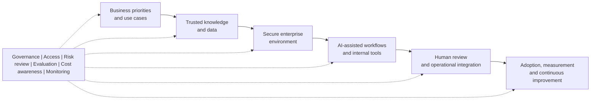

# Ben Zulu

### Enterprise Technology | AI Enablement | Workflow Transformation

I help teams turn emerging technology into practical, repeatable, and well-governed ways of working.

  
  
  

## About Me

I am an enterprise technology and AI enablement professional with more than 12 years of experience across complex business environments. My background combines technical operations, stakeholder engagement, escalation management, cloud and SaaS support, documentation, mentoring, and technology adoption.

My current focus is helping organisations move from isolated AI experimentation to useful operating practices: clear use cases, trusted information, structured workflows, responsible review, measurable outcomes, and support that helps people adopt new tools confidently.

## What I Bring

- AI adoption, enablement, and practical workflow design
- Enterprise technology operations and service improvement
- Business-to-technology translation and requirements discovery
- Knowledge management, documentation, and reusable playbooks
- Responsible AI practices, human review, and governance checkpoints
- Stakeholder engagement across technical and non-technical teams
- Proof-of-concept development and lightweight automation
- Training, mentoring, and adoption support

## Technology

  
  
  
  
  
  
  
  

## Current Interests

- AI transformation and enterprise adoption
- Workflow automation and operational improvement
- Reliable knowledge and retrieval practices
- AI-assisted developer and business workflows
- Evaluation, evidence, and human oversight
- Cost-aware technology selection
- Change management and workforce enablement

## Enterprise AI Enablement Pattern

This public-safe pattern shows how I approach the move from AI experimentation to governed, useful adoption.

The technologies can change; the disciplines of ownership, evidence, access, review, operational support, and measurement remain essential.

## Working Principles

1. Start with the business problem.
2. Understand the people and workflow involved.
3. Build the smallest useful solution.
4. Make ownership, review, and risk visible.
5. Test under realistic operating conditions.
6. Document what works and make it repeatable.
7. Measure adoption and improve continuously.

## Selected Public Work

### [Enterprise AI Enablement Playbook](https://github.com/respectyourelders86-wq/enterprise-ai-enablement-playbook)

A practical, employer-safe collection of patterns for AI use-case discovery, knowledge and context readiness, governance, controlled pilots, human review, adoption, monitoring, and cost awareness.

All examples use fictional or demonstration scenarios and communicate practical thinking without exposing confidential systems or information.

## Connect

I am interested in roles spanning AI enablement, technology transformation, solution architecture, enterprise platforms, workflow improvement, and technical adoption.

- Location: Melbourne, Australia

