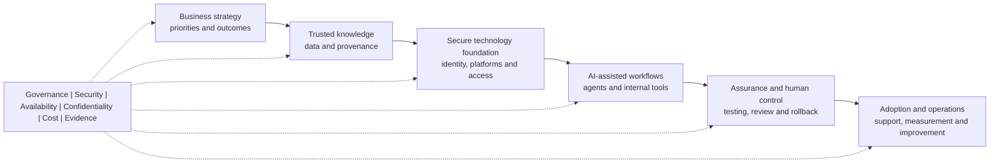

# Ben Zulu

### Digital & Technology Strategy | Enterprise IT | AI Enablement

I help organisations turn technology and AI opportunities into secure, practical, and well-governed ways of working.

  
  
  

## About Me

I am an enterprise technology and AI enablement professional with more than 12 years of experience across complex business environments. My background spans enterprise support and service delivery, cloud and SaaS platforms, infrastructure, identity and access, stakeholder engagement, escalation management, documentation, mentoring, and technology adoption.

My current focus is the bridge between strategy and execution: understanding the business problem, improving the underlying workflow and information, selecting fit-for-purpose technology, testing safely, establishing governance, and helping people adopt the resulting service with confidence.

## What I Bring

- Digital and technology strategy translated into practical delivery priorities
- Enterprise technology operations, service improvement, and operational readiness
- AI adoption, workflow redesign, and responsible enablement
- Business-to-technology translation and requirements discovery
- Knowledge management, data readiness, retrieval, and reusable playbooks
- Human review, access control, evidence, and governance checkpoints
- Proof-of-concept development, automation, and realistic testing
- Stakeholder engagement, training, mentoring, and change support

## Enterprise Technology and AI Practice

| Domain | Public-safe evidence of practice |
|---|---|
| Technology foundations | Cloud and SaaS platforms, Windows and Linux systems, endpoint and service operations, identity and access, and private infrastructure labs |
| Data and knowledge | Structured ingestion, relational data, semantic retrieval, source provenance, RAG patterns, and graph-aware knowledge mapping |
| AI and automation | Bounded agent workflows, orchestration patterns, reusable task interfaces, human approvals, evaluation, and observable handoffs |
| Identity lab | Active Directory-compatible directory services using Samba, role-scoped access, and controlled authentication experiments |
| Delivery assurance | End-to-end journey testing, API and state verification, change control, rollback planning, incident readiness, and audit evidence |
| Governance readiness | Security, availability, and confidentiality control mapping aligned to SOC 2 readiness; no certification claim |

My hands-on lab work uses private, self-hosted environments so I can test integration, failure handling, recovery, observability, and governance without exposing employer or client systems. Public examples are deliberately sanitised and use fictional or demonstration data.

## Technology

  
  
  
  
  
  
  
  

## Enterprise AI Enablement Pattern

The technologies can change. Clear ownership, trusted information, secure access, evidence, operational support, and measurable outcomes remain essential.

## Working Principles

1. Start with the business problem and desired outcome.
2. Understand the people, information, systems, and workflow involved.
3. Build the smallest useful and supportable solution.
4. Make ownership, access, review, risk, and cost visible.
5. Test realistic user journeys and failure conditions.
6. Document decisions, controls, rollback, and operational support.
7. Measure adoption and improve continuously.

## Selected Public Work

### [Enterprise AI Enablement Playbook](https://github.com/respectyourelders86-wq/enterprise-ai-enablement-playbook)

A practical, employer-safe collection of patterns for AI use-case discovery, enterprise technology foundations, knowledge and context readiness, governance, controlled pilots, human review, adoption, monitoring, and cost awareness.

All public examples use fictional or demonstration scenarios. They show the operating disciplines without exposing confidential systems, source code, credentials, private infrastructure, or proprietary architecture.

## Connect

I am interested in leadership and senior roles spanning digital and technology strategy, enterprise IT, AI enablement, technology transformation, solution architecture, workflow improvement, and responsible adoption.

- Location: Melbourne, Australia
- LinkedIn: [linkedin.com/in/benjaminzulu](https://au.linkedin.com/in/benjaminzulu)

