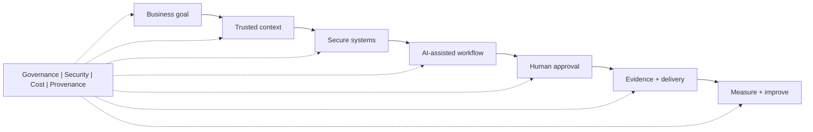

# Ben Zulu

### Founder, Born 2 Win Pty Ltd · Enterprise Technology · AI Systems · Product Ventures

I build practical AI-enabled businesses and operating systems that connect strategy, software, data, automation, governance, and real-world delivery.

  
  
  

## About

I am the founder of **Born 2 Win Pty Ltd**, an Australian venture company focused on building useful products, AI-enabled workflows, internal operating systems, and digital businesses.

My background spans more than 12 years in enterprise technology across infrastructure, SaaS platforms, identity and access, service operations, support, stakeholder engagement, escalation management, documentation, and technology adoption.

My current work sits at the intersection of **business design and technical execution**: defining the outcome, structuring the workflow, building the software and data layer, introducing AI where it adds measurable leverage, and keeping human ownership, evidence, security, and operational control visible.

## Current Focus

### Born 2 Win — AI Operating Environment

A private, multi-agent operating environment for coordinating business, engineering, research, design, operations, and evidence across multiple ventures.

Public-safe areas of exploration include:

- bounded AI agents and orchestrated workflows
- human approval gates and evidence-led execution
- retrieval, structured memory, provenance, and knowledge systems
- Linux and cloud-hosted runtime environments
- secure service integration and operational observability
- reusable skills, task contracts, and agent handoffs

### Respect Your Elders

**Respect Your Elders (RYE)** is a premium apparel venture built around legacy, respect, roots, and intergenerational connection.

The product work combines brand design with practical manufacturing systems: garment specification, fabric research, supplier qualification, sample control, packaging, intellectual-property protection, and e-commerce delivery.

> From seed to ancient tree, we are each other's elder.

### AI Enablement & Product Engineering

I use AI as part of a governed delivery system rather than as a standalone chatbot. Typical patterns include:

- problem and workflow discovery
- structured context and memory
- model routing by task
- agent/tool orchestration
- database-backed state
- human review and approval
- testing, rollback, and audit evidence
- continuous refinement from real outcomes

## Enterprise Technology and AI Practice

| Domain | Public-safe evidence of practice |
|---|---|
| Technology foundations | Cloud and SaaS platforms, Windows and Linux systems, endpoint and service operations, identity and access, and private infrastructure labs |
| Data and knowledge | Structured ingestion, relational data, semantic retrieval, source provenance, RAG patterns, and graph-aware knowledge mapping |
| AI and automation | Bounded agent workflows, orchestration, reusable task interfaces, human approvals, evaluation, and observable handoffs |
| Product engineering | Web applications, APIs, databases, automation, prototyping, technical documentation, and iterative delivery |
| Delivery assurance | End-to-end journey testing, API/state verification, change control, rollback planning, incident readiness, and audit evidence |
| Governance readiness | Security, availability, confidentiality, cost, access control, human review, and evidence checkpoints |

## Technology

  
  
  
  
  
  
  
  

## Operating Pattern

```mermaid
flowchart LR
    A["Business goal"] --> B["Trusted context"]
    B --> C["Secure systems"]
    C --> D["AI-assisted workflow"]
    D --> E["Human approval"]
    E --> F["Evidence + delivery"]
    F --> G["Measure + improve"]

    H["Governance | Security | Cost | Provenance"]
    H -.-> A
    H -.-> B
    H -.-> C
    H -.-> D
    H -.-> E
    H -.-> F
    H -.-> G
```

## Working Principles

1. Start with the business problem and desired outcome.
2. Keep ownership and decision rights explicit.
3. Give AI the minimum authority required for the task.
4. Separate persistent truth from temporary conversation context.
5. Preserve evidence for important decisions and changes.
6. Test realistic journeys, failure conditions, and rollback paths.
7. Build the smallest useful system, then improve from real use.

## Selected Public Work

### [Enterprise AI Enablement Playbook](https://github.com/respectyourelders86-wq/enterprise-ai-enablement-playbook)

A public-safe collection of patterns for AI use-case discovery, knowledge and context readiness, secure technology foundations, controlled pilots, governance, human review, adoption, monitoring, and cost awareness.

Public repositories deliberately exclude private infrastructure details, credentials, proprietary agent configuration, personal data, and confidential operating information.

## Connect

- **Location:** Melbourne, Australia
- **LinkedIn:** [linkedin.com/in/benjaminzulu](https://au.linkedin.com/in/benjaminzulu)

